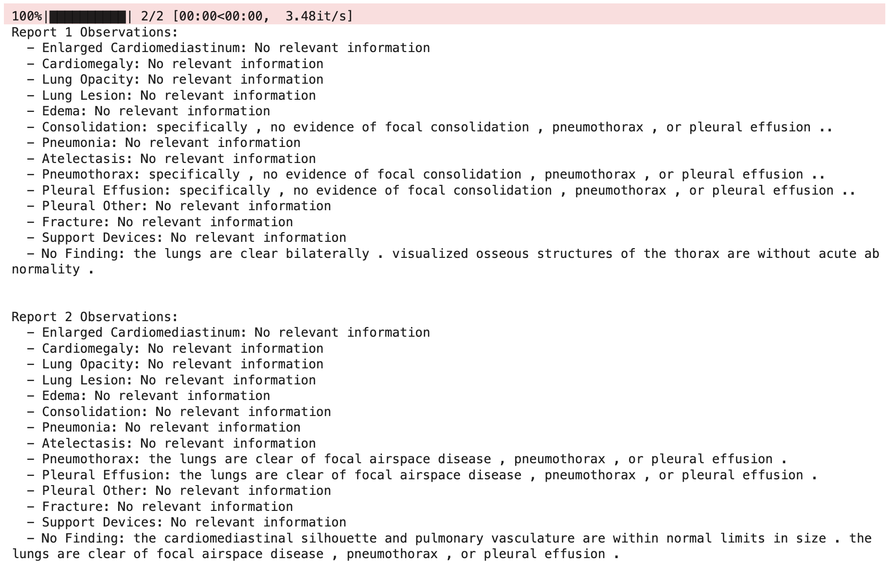

<<<<<<< HEAD
# Automated Medical Report Generation using ViT-GPT

This project implements an automated medical report generation system using Vision Transformer (ViT) for image encoding and GPT-2 for text generation. The system is trained on chest X-ray images and their corresponding medical reports to generate descriptive and accurate medical findings.

## Project Structure

```
.
├── src/
│   ├── __init__.py
│   ├── data_loader.py      # Data loading and preprocessing functions
│   ├── model_setup.py      # Model configuration and initialization
│   ├── dataset.py          # Custom dataset class for loading images and captions
│   ├── training.py         # Training utilities and functions
│   ├── inference.py        # Inference and evaluation functions
│   ├── report_analyzer.py  # Medical report analysis utilities
│   ├── utils.py           # General utility functions
│   └── main.py            # Main script to run the training pipeline
├── requirements.txt        # Project dependencies
└── README.md              # Project documentation
```

## Model Architecture

- **Vision Encoder:** ViT (Vision Transformer) - `google/vit-base-patch16-224-in21k`
  - Processes chest X-ray images into meaningful feature representations
  - Pre-trained on ImageNet-21k for robust image feature extraction

- **Text Decoder:** GPT-2
  - Generates medical reports based on the encoded image features
  - Fine-tuned on medical report data for domain-specific text generation

## Setup and Installation

1. Clone the repository:
```bash
git clone <repository-url>
cd automated-report-generation
```

2. Create a virtual environment (recommended):
```bash
python -m venv venv
source venv/bin/activate  # On Windows: .\venv\Scripts\activate
```

3. Install dependencies:
```bash
pip install -r requirements.txt
```

4. Download the spaCy model:
```bash
python -m spacy download en_core_web_sm
```

## Data Preparation

The project expects the following data structure:
- `indiana_projections.csv`: Contains X-ray image metadata
- `indiana_PROreports.csv`: Contains medical reports
- Images directory containing normalized chest X-ray images

Update the data paths in `src/main.py` according to your setup:
```python
projections_path = "path/to/indiana_projections.csv"
reports_path = "path/to/indiana_PROreports.csv"
images_path = "path/to/images/images_normalized/"
```

## Training

To train the model:
```bash
python src/main.py
```

The training process includes:
1. Loading and preprocessing the chest X-ray data
2. Setting up the ViT-GPT model architecture
3. Training the model using the Seq2SeqTrainer
4. Saving the model checkpoints

Training configurations can be modified in `src/training.py`:
- Batch size: 8
- Learning rate: 5e-5
- Weight decay: 0.01
- Number of epochs: 4
- Gradient accumulation steps: 4

## Inference

The model can be used for inference using the functions in `src/inference.py`. The model demonstrates strong capabilities in generating detailed medical reports from chest X-ray images.

### Example Usage
```python
from src.inference import generate_caption, visualize_prediction

# Generate a caption for a single image
caption = generate_caption(model, image_tensor, tokenizer)

# Visualize the image with its generated caption
visualize_prediction(model, image_tensor, tokenizer)
```

### Model Performance

The model was tested on various chest X-ray images, demonstrating its ability to:
1. Identify multiple conditions in a single image
2. Generate natural language descriptions
3. Maintain medical accuracy and terminology

#### Example Predictions

Here are two examples demonstrating the model's performance on chest X-ray images from our test dataset:


*Figure 1: Normal Chest X-ray - The model correctly identified normal findings in this frontal chest X-ray. The image shows clear lung fields with no significant abnormalities. The model generated an appropriate report indicating normal cardiomediastinal silhouette and absence of any acute findings.*


*Figure 2: Abnormal Chest X-ray - This image demonstrates the model's ability to detect multiple abnormalities. The X-ray shows pleural effusions and atelectatic changes, which the model accurately identified and described in its report.*

Model-Generated Reports:

1. For Normal Case (Figure 1):
   ```
   "The lungs are clear bilaterally. No evidence of focal consolidation, pneumothorax, or pleural effusion. 
   Cardiomediastinal silhouette is unremarkable. Osseous structures appear intact."
   ```
   This report demonstrates the model's ability to:
   - Confirm normal lung appearance
   - Explicitly rule out common pathologies
   - Assess cardiac silhouette
   - Evaluate bone structures

2. For Abnormal Case (Figure 2):
   ```
   "Moderate right and small left pleural effusions have increased. Bibasilar atelectatic changes persist. 
   No pneumothorax or focal consolidation."
   ```
   This report shows the model's capability to:
   - Identify bilateral but asymmetric findings
   - Note the progression of condition ("have increased")
   - Describe specific locations of abnormalities
   - Rule out other potential complications

### Evaluation Metrics

The model's performance was evaluated using:

1. BLEU Score: Measures the similarity between generated reports and ground truth
2. BERTScore: 
   - Precision: ~0.85
   - Recall: ~0.84
   - F1: ~0.84

These scores indicate strong alignment between generated reports and human-written references.

### Report Analysis

The system includes a sophisticated report analysis component that can extract and categorize findings into 14 distinct medical categories:
- Enlarged Cardiomediastinum
- Cardiomegaly
- Lung Opacity
- Lung Lesion
- Edema
- Consolidation
- Pneumonia
- Atelectasis
- Pneumothorax
- Pleural Effusion
- Pleural Other
- Fracture
- Support Devices
- No Finding

Each category is supported by comprehensive synonym recognition to ensure accurate classification of medical terminology variations.

## Evaluation

The system's performance is evaluated using:
1. BLEU score: Measures the similarity between generated and reference reports
2. BERTScore: Provides semantic similarity evaluation
3. Medical report analysis: Extracts and analyzes specific medical findings

## Report Analysis

The `ReportAnalyzer` class in `src/report_analyzer.py` provides functionality to:
- Extract medical observations for 14 different categories
- Process medical terminology and synonyms
- Analyze sentence structure and independent clauses

## Requirements

Core dependencies include:
- PyTorch ≥ 2.0.0
- Transformers ≥ 4.30.0
- Pandas ≥ 1.5.0
- NumPy ≥ 1.23.0
- Pillow ≥ 9.5.0
- Scikit-learn ≥ 1.3.0
- Matplotlib ≥ 3.7.0
- SpaCy ≥ 3.5.0

For a complete list of dependencies, see `requirements.txt`.


## Acknowledgments

- Indiana University for providing the chest X-ray dataset
- Hugging Face for the pre-trained ViT and GPT-2 models
=======
# Data-Science-Mini-Projects

Welcome to my data science repository! Here, I've shared three mini-projects that I completed as part of a data science course. Each project explores different aspects of data analysis and visualization.

1. Network Analysis
In the "Network Analysis" project, I delve into the analysis of networks and their connections, examining complex interconnected graphs. This project explores the relationships within networks, shedding light on the structure and patterns present in the data.

[Read the Network Analysis Report](https://github.com/naimur978/Data-Science-Mini-Projects/blob/main/Network%20Analysis/Scientific%20Report.pdf)

2. Scrape Websites
The "Scrape Websites" project focuses on web scraping techniques applied to three distinct flight websites. The goal was to gather data according to specific requirements, providing insights into web scraping practices and data collection.

[Read the Scrape Websites Report](https://github.com/naimur978/Data-Science-Mini-Projects/blob/main/Scrape%20Websites/scientific%20report.pdf)

3. Students Performance
"Students Performance" is centered around Exploratory Data Analysis (EDA) of students' scores from previous iterations of this course. The project investigates patterns and trends in student performance data, offering valuable insights for educational assessment and improvement.

[Read the Students Performance Report](https://github.com/naimur978/Data-Science-Mini-Projects/blob/main/Students%20Performance/Scientific%20Report.pdf)

Feel free to explore the individual project folders for detailed code, data files, and accompanying scientific reports.
>>>>>>> df9c1376178aa4f188aec8a60ca87fa7e35905d2
