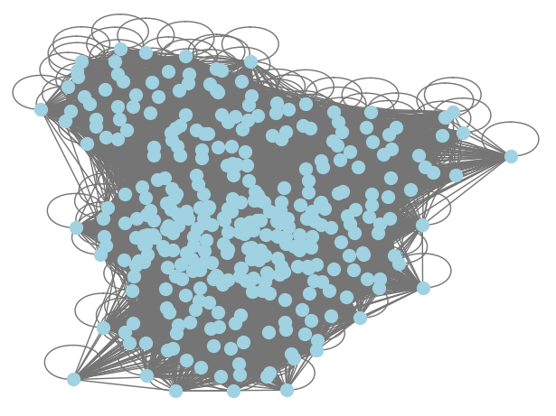
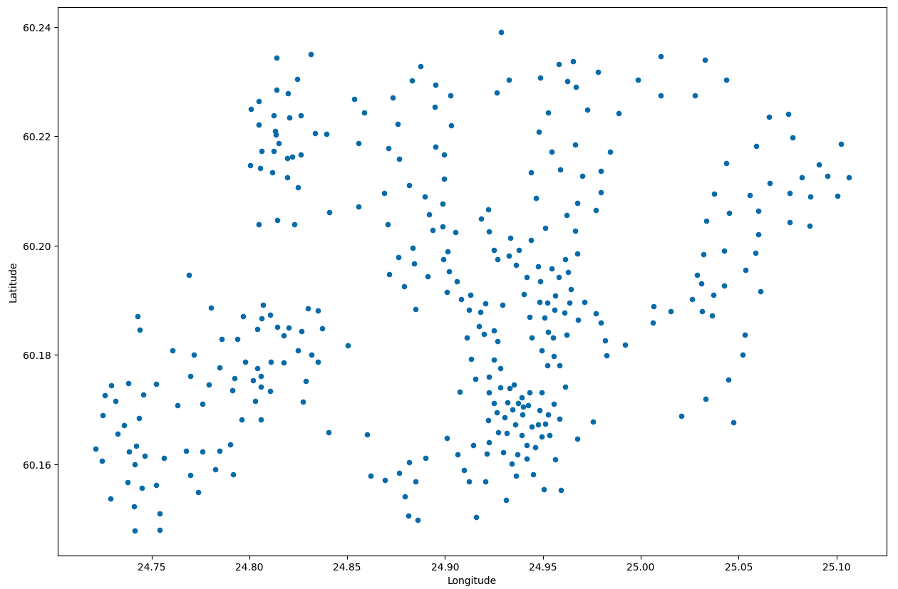
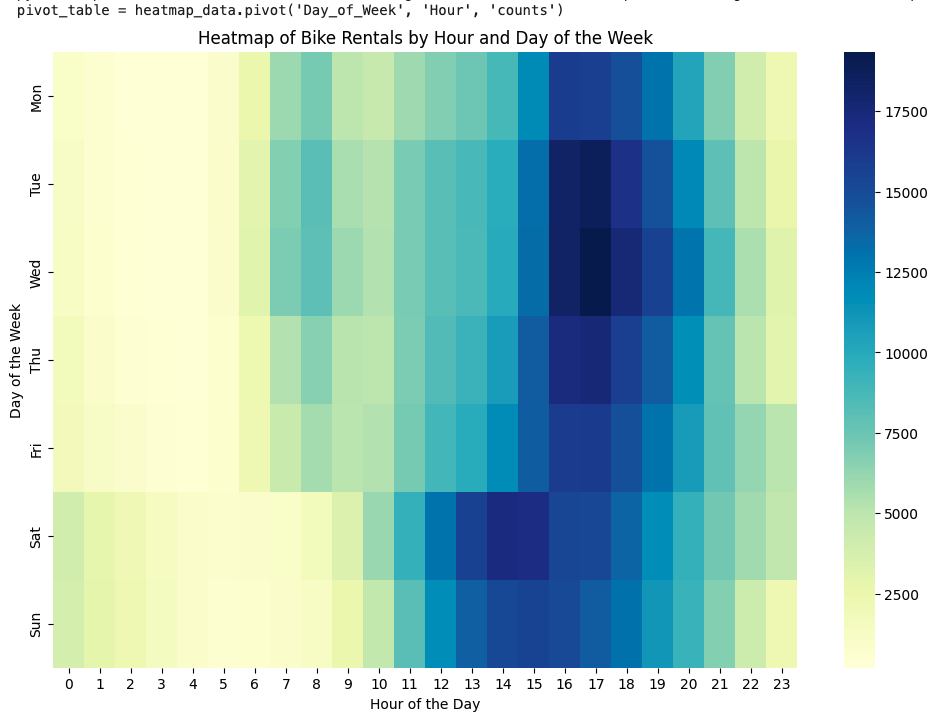
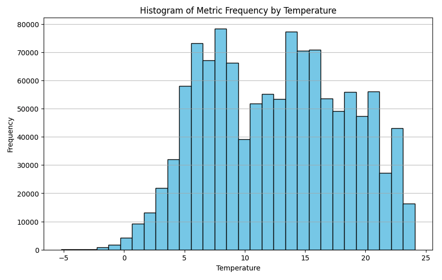
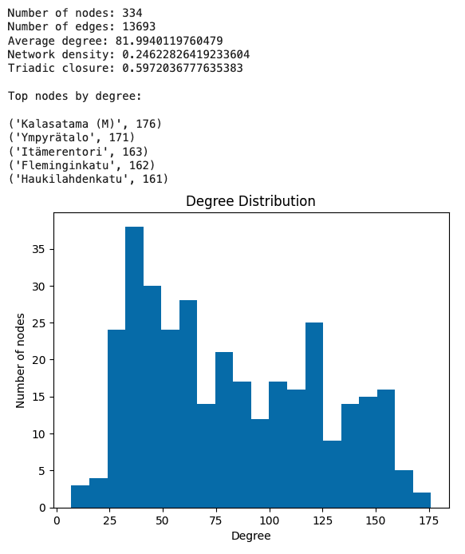
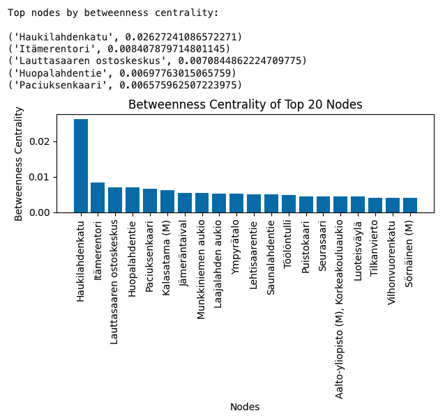
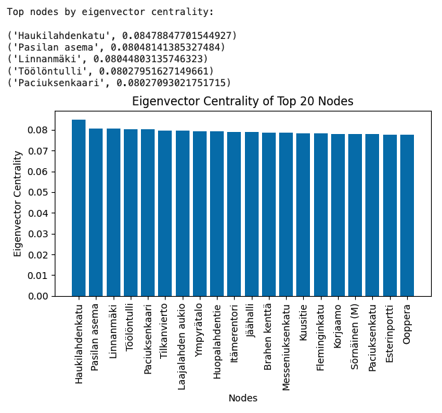
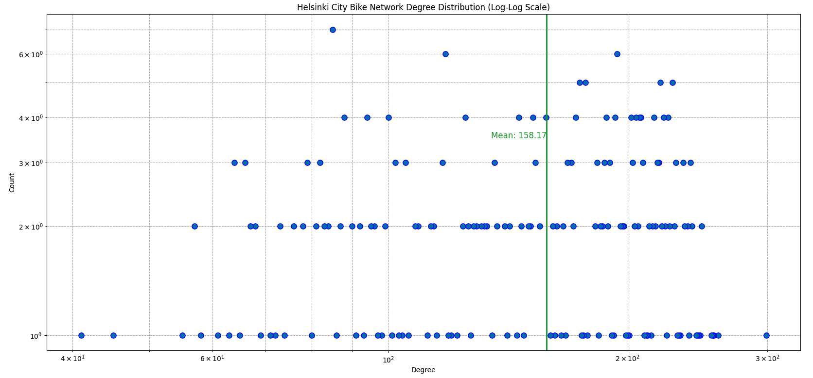
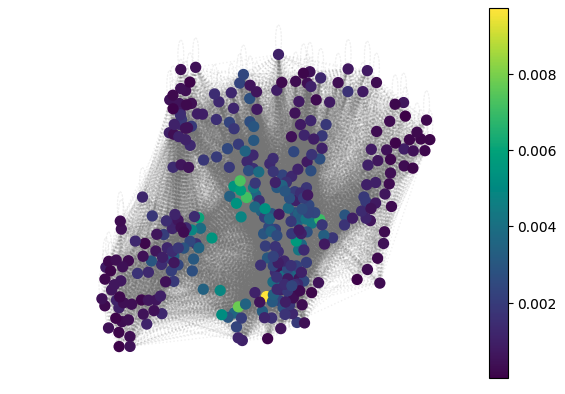

# Network Analysis

This project focuses on analyzing networks using various techniques and tools. The folder contains code, a scientific report, and a proposal document.

## Folder Structure

```
Network Analysis/
├── Code.ipynb          # Jupyter Notebook for network analysis
├── Scientific Report.pdf # Detailed report on the analysis
├── proposal.pdf        # Proposal outlining the goals and methodology
```

## Code

The `Code.ipynb` notebook contains the implementation of network analysis techniques. It includes:
- Data preprocessing
- Network construction
- Visualization
- Metrics calculation

## Proposal

The `proposal.pdf` outlines the initial goals and approach for the network analysis project.

## Images

Below are some of the key visualizations generated during the analysis (see the `figures/` folder for all images):

| Figure | Image | Description |
|:------:|:-----:|:------------|
| 1 |  | Visualization of the network structure. |
| 2 |  | Analysis of node centrality metrics. |
| 3 |  | Community detection results. |
| 4 |  | Network density and clustering coefficients. |
| 5 |  | Temporal evolution of the network. |
| 6 |  | Comparison of different network layouts. |
| 7 |  | Degree distribution analysis. |
| 8 |  | Edge betweenness centrality visualization. |
| 9 |  | Additional insights from the network analysis. |

## Scientific Report

For a detailed overview of the analysis, including objectives, methodology, results, and conclusions, refer to the [Scientific Report](Scientific%20Report.pdf).
