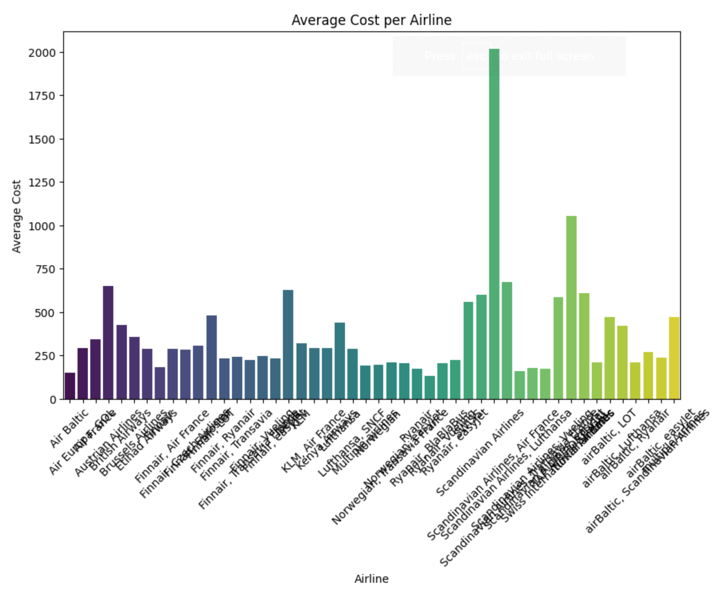

# Scrape Websites

This project contains code and notebooks for scraping flight data from multiple travel websites, performing exploratory data analysis (EDA), and visualizing the results.

## Folder Structure

```
Scrape Websites/
├── eda.ipynb           # Exploratory data analysis and visualization
├── expedia.csv         # Raw scraped data from Expedia
├── expedia.ipynb       # Expedia scraping and analysis notebook
├── figures/            # Generated figures for analysis
├── kayak.csv           # Raw scraped data from Kayak
├── kayak.ipynb         # Kayak scraping and analysis notebook
├── momondo.csv         # Raw scraped data from Momondo
├── momondo.ipynb       # Momondo scraping and analysis notebook
├── scientific report.pdf # Project report
```

## Notebooks

- **expedia.ipynb, kayak.ipynb, momondo.ipynb**: Contain code for scraping flight data from each respective website and initial data cleaning.
- **eda.ipynb**: Loads the combined data, performs preprocessing, and generates visualizations to compare prices, durations, and other features across websites.

## Data Files

- **expedia.csv, kayak.csv, momondo.csv**: Contain the raw flight data scraped from each website. Each file typically includes columns such as price, duration, stops, and airline.

## How to Use

1. Run the scraping notebooks (`expedia.ipynb`, `kayak.ipynb`, `momondo.ipynb`) to collect and clean data from each website.
2. Use `eda.ipynb` to load the CSV files, merge the data, and perform analysis/visualization.

## Requirements

- Python 3.8+
- pandas
- numpy
- matplotlib
- seaborn

Install dependencies with:
```bash
pip install pandas numpy matplotlib seaborn
```

## Example Figures

Here are some of the main figures from the analysis (see the `figures/` folder for all the images):

| Figure | Image | What It Shows |
|:------:|:-----:|:--------------|
| 1 |  | **How much do flights cost?**<br>This chart shows the price spread for flights on Expedia, Kayak, and Momondo. It's easy to spot which site tends to have pricier or cheaper flights, and see if there are any big outliers. |
| 2 |  | **How long are the flights?**<br>This one compares flight durations across the different sites. Useful for seeing if one site lists much longer (or shorter) trips than the others. |
| 3 |  | **Which site is cheapest on average?**<br>This bar chart sums up the average price for each website, making it clear which one generally offers the best deal. |
| 4 |  | **What about layovers?**<br>This chart digs into layover times and cities. Great for anyone who wants to avoid long layovers or certain airports. |
| 5 |  | **When do flights arrive and leave?**<br>Arrival and departure times are plotted to spot trends—like whether most flights land early, late, or during busy hours. |
| 6 |  | **How do airlines compare?**<br>This chart puts airlines side by side on things like price and duration, showing which ones are usually faster or cheaper. |
| 7 |  | Another interesting chart from the data—could be a pie chart, scatter plot, or something else that stood out. |
| 8 |  | Demo outputs |

For all the details and more in-depth explanations, see `scientific report.pdf` in this folder!

